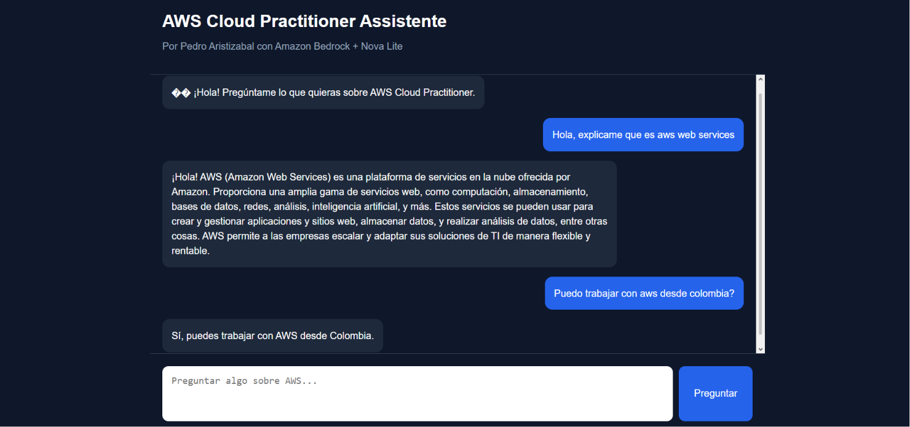
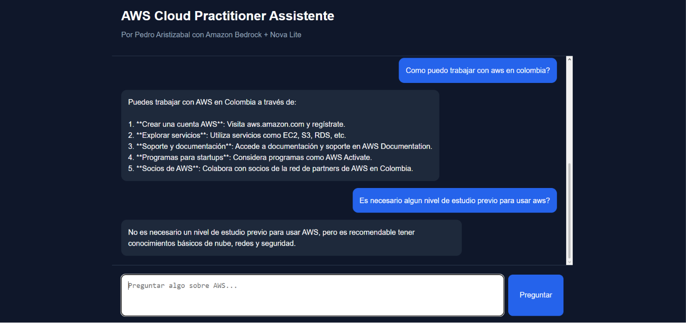
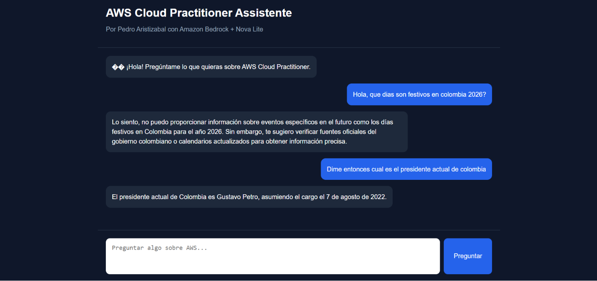
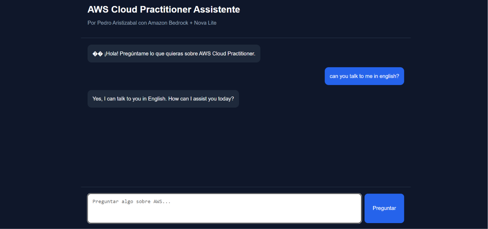

````markdown
# NovaLink AWS AI Agent

Asistente conversacional basado en IA enfocado en conceptos de AWS Cloud Practitioner.  
La aplicación utiliza servicios serverless de AWS y modelos fundacionales de Amazon Bedrock para responder preguntas relacionadas con cloud computing, AWS y tecnología.

---

# Arquitectura del Proyecto

La aplicación está construida utilizando una arquitectura moderna serverless en AWS:

- **Frontend:** HTML, CSS y JavaScript
- **Backend:** AWS Lambda con Python
- **API:** Amazon API Gateway
- **IA Generativa:** Amazon Bedrock + Nova Lite
- **Infraestructura como código:** Terraform
- **CI/CD:** GitHub Actions

---

# Funcionamiento General

1. El usuario escribe una pregunta en la interfaz web.
2. El frontend envía la solicitud mediante HTTP hacia Amazon API Gateway.
3. API Gateway invoca una función AWS Lambda desarrollada en Python.
4. La función Lambda procesa la petición y realiza una llamada a Amazon Bedrock.
5. Bedrock utiliza el modelo Nova Lite para generar la respuesta.
6. Lambda devuelve la respuesta al frontend.
7. La interfaz muestra el mensaje generado por la IA en tiempo real.

---

# Tecnologías Utilizadas

## Frontend
- HTML5
- CSS3
- JavaScript Vanilla

## Backend
- Python
- AWS Lambda

## Servicios AWS
- Amazon API Gateway
- Amazon Bedrock
- Nova Lite
- IAM

## DevOps / Infraestructura
- Terraform
- GitHub Actions

---

# Estructura del Proyecto

```bash
NovaLink-AWS-AI-Agent/
│
├── .github/workflows/
│   └── deploy.yml
│
├── app/
│   ├── docs/
│   │
│   ├── frontend/
│   │   ├── app.js
│   │   ├── index.html
│   │   └── style.css
│   │
│   └── lambda/
│       ├── app.py
│       └── lambda.zip
│
├── infra/
│   ├── main.tf
│   ├── outputs.tf
│   ├── provider.tf
│   └── terraform.tfstate
│
├── .gitignore
└── README.md
````

---

# Componentes Principales

## Frontend

La interfaz web fue desarrollada utilizando HTML, CSS y JavaScript puro.

Permite:

* Enviar preguntas al backend
* Mostrar mensajes del usuario y del asistente
* Mantener una experiencia visual tipo chat
* Consumir la API REST creada con API Gateway

---

## API Gateway

Amazon API Gateway funciona como punto de entrada para las solicitudes HTTP del frontend.

### Responsabilidades:

* Recibir peticiones del cliente
* Gestionar CORS
* Integrarse con AWS Lambda
* Exponer endpoints REST

---

## AWS Lambda

La lógica backend se ejecuta en una función serverless desarrollada en Python.

### La Lambda:

* Recibe la pregunta del usuario
* Construye el prompt
* Invoca Amazon Bedrock
* Procesa la respuesta del modelo
* Devuelve el resultado al frontend

---

## Amazon Bedrock + Nova Lite

Amazon Bedrock permite consumir modelos fundacionales sin administrar infraestructura.

### Modelo utilizado:

* Nova Lite

### Funciones:

* Generación de respuestas inteligentes
* Procesamiento de lenguaje natural
* Conversación contextual

---

# Infraestructura como Código (Terraform)

Terraform fue utilizado para automatizar el despliegue de la infraestructura AWS.

### Recursos gestionados:

* AWS Lambda
* API Gateway
* Roles IAM
* Permisos
* Integraciones

### Ventajas:

* Despliegue reproducible
* Versionamiento de infraestructura
* Automatización
* Fácil mantenimiento

---

# CI/CD con GitHub Actions

GitHub Actions automatiza el proceso de despliegue.

### El pipeline:

1. Detecta cambios en el repositorio
2. Ejecuta validaciones
3. Empaqueta la Lambda
4. Ejecuta Terraform
5. Despliega automáticamente la infraestructura

---

# Capturas de Pantalla

## Chat principal



---

## Conversación sobre AWS



---

## Preguntas generales



---

## Soporte multilenguaje



---

# Características

* Arquitectura serverless
* Integración con IA generativa
* Despliegue automatizado
* Infraestructura como código
* Chat interactivo en tiempo real
* Diseño responsive
* Bajo costo operativo

---

# Posibles Mejoras Futuras

* Historial de conversaciones
* Autenticación con Amazon Cognito
* Memoria conversacional

---

# Cómo Ejecutar el Proyecto

## 1. Clonar repositorio

```bash
git clone https://github.com/tu-usuario/tu-repositorio.git
```

---

## 2. Configurar credenciales AWS

```bash
aws configure
```

---

## 3. Inicializar Terraform

```bash
cd infra

terraform init
terraform plan
terraform apply
```

---

## 4. Desplegar frontend

Abrir:

```bash
app/frontend/index.html
```

---

# Arquitectura de Flujo

```text
Usuario
   │
   ▼
Frontend (HTML/CSS/JS)
   │
   ▼
API Gateway
   │
   ▼
AWS Lambda (Python)
   │
   ▼
Amazon Bedrock (Nova Lite)
   │
   ▼
Respuesta IA
   │
   ▼
Frontend
```

---

# Autor

Pedro Aristizabal
Software Developer | Cloud & AI Enthusiast

---

# Licencia

Este proyecto es de uso educativo y demostrativo.

```
```
